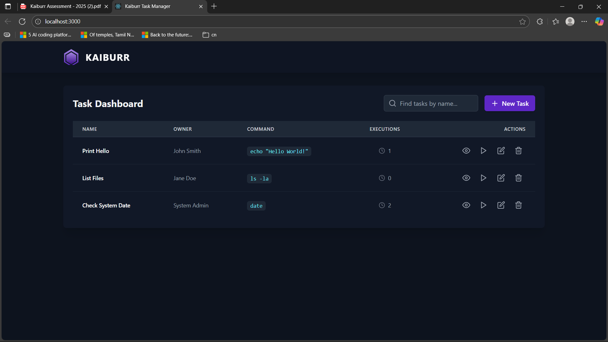
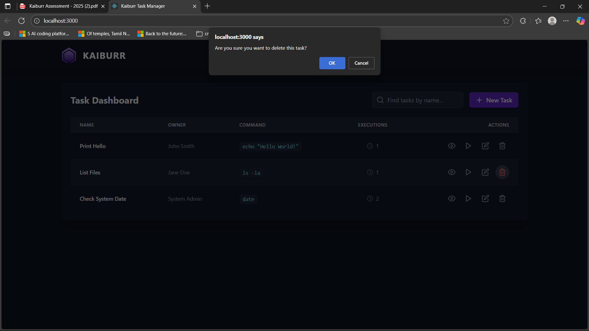

# Kaiburr Task Manager

Disclaimer: AI extensively used!

A modern web UI to manage shell command tasks. This application allows users to create, view, search, delete, and run tasks, as well as view their execution output. It's built with React, TypeScript, and styled with Tailwind CSS, featuring a clean, responsive, and intuitive interface.








count also increases

## ✨ Features

- **CRUD Operations:** Full capabilities to Create, Read, Update, and Delete tasks.
- **Task Execution:** Run any configured task with a single click and view a detailed history of each execution, including start/end times and command output.
- **Real-time Search:** Instantly find tasks by name with a debounced search input for a smooth user experience.
- **Responsive Design:** A mobile-first design that looks and works great on any device, from desktops to smartphones.
- **Interactive Modals:** Streamlined workflows for creating, editing, and viewing task details without leaving the main dashboard.
- **Mock API:** A client-side mock API service that simulates network latency and backend behavior, making the frontend fully testable and runnable without a real backend.
- **Clean & Modern UI:** Styled with Tailwind CSS for a professional and visually appealing interface, featuring custom brand colors and a dark theme.

## 🛠️ Tech Stack

- **Frontend:** [React](https://reactjs.org/) (v18+)
- **Language:** [TypeScript](https://www.typescriptlang.org/)
- **Styling:** [Tailwind CSS](https://tailwindcss.com/)
- **Icons:** Custom SVG components
- **Development Server:** [Vite](https://vitejs.dev/) (Recommended)

## 📂 Project Structure

The project is organized into logical folders and components for clarity and maintainability.

```
.
├── public/
├── src/
│   ├── components/       # Reusable React components
│   │   ├── Header.tsx
│   │   ├── Icons.tsx
│   │   ├── TaskDetailsModal.tsx
│   │   ├── TaskFormModal.tsx
│   │   └── TaskList.tsx
│   ├── services/         # Mock API service for data handling
│   │   └── apiService.ts
│   ├── App.tsx           # Main application component with state and logic
│   ├── index.css         # Global styles (if any)
│   ├── index.tsx         # React entry point
│   └── types.ts          # TypeScript type definitions
├── .gitignore
├── index.html            # Main HTML file
├── package.json
└── README.md
```

## 🚀 Getting Started

Follow these instructions to set up and run the project locally.

### Prerequisites

- [Node.js](https://nodejs.org/) (v16 or newer)
- [npm](https://www.npmjs.com/) (or [yarn](https://yarnpkg.com/)/[pnpm](https://pnpm.io/))

### Installation & Setup

1.  **Clone the repository:**
    ```bash
    git clone https://github.com/your-username/kaiburr-task-manager.git
    cd kaiburr-task-manager
    ```
    *(If you don't have a git repo, simply create a project folder and place the files inside it as per the structure above.)*

2.  **Install dependencies:**
    Run the following command in the project root to install the necessary packages.
    ```bash
    npm install
    ```
    This will install React, ReactDOM, and development dependencies like Vite and TypeScript.

3.  **Run the development server:**
    Once the installation is complete, start the local development server.
    ```bash
    npm run dev
    ```

4.  **Open in browser:**
    The application will be running at `http://localhost:5173` (or another port if 5173 is in use). Open this URL in your web browser to view the app.

## 🧩 Component Overview

- **`App.tsx`**: The main stateful component that orchestrates the entire application. It manages tasks, loading states, errors, and modal visibility. It also contains the handlers for all API interactions.
- **`Header.tsx`**: A simple, stateless component that displays the application logo and title.
- **`TaskList.tsx`**: Renders the list of tasks in a responsive table. It accepts props for handling user actions like deleting, running, editing, or viewing a task.
- **`TaskFormModal.tsx`**: A versatile modal used for both creating a new task and editing an existing one. It includes form state management and validation.
- **`TaskDetailsModal.tsx`**: A read-only modal that displays detailed information about a task, including its command and a chronologically sorted list of its execution history.
- **`Icons.tsx`**: A collection of stateless SVG icon components used throughout the UI to ensure visual consistency.

## 🌐 Mock API Service (`services/apiService.ts`)

To allow the frontend to be developed and tested independently, a mock API is provided in `src/services/apiService.ts`.

- It uses an in-memory array to store the task data.
- All functions are `async` and use a `simulateDelay` helper to mimic real network latency.
- It provides functions for all necessary data operations: `getTasks`, `findTasksByName`, `createOrUpdateTask`, `deleteTask`, and `runTaskExecution`.
- Includes basic validation to prevent potentially harmful commands (e.g., `rm -rf`).

This setup ensures that the UI logic for handling loading, error, and success states can be fully implemented and tested without needing a live backend connection.
# kaiburr-task3


